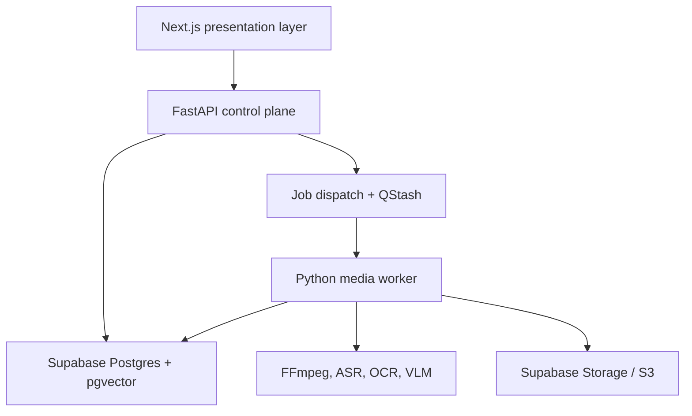
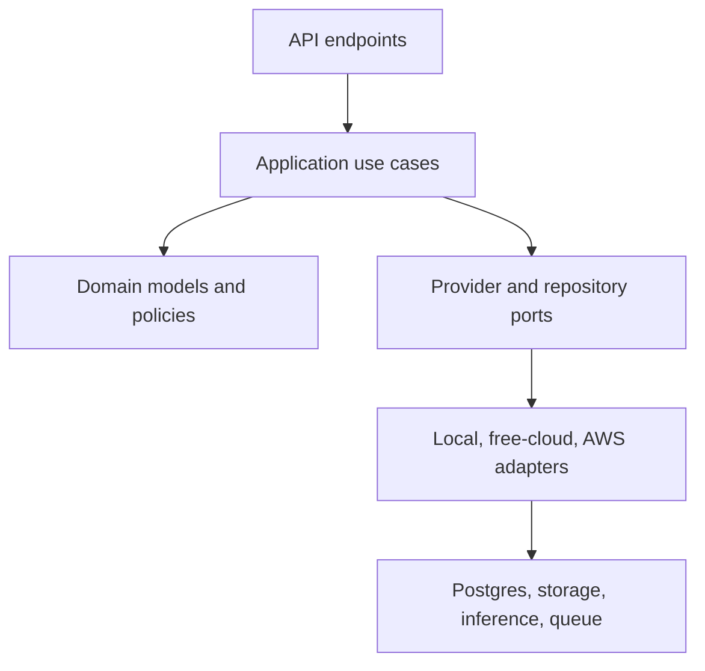
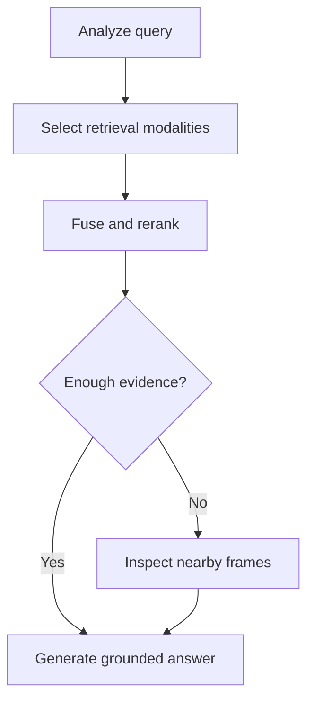

# GalaxyFrog implementation plan

The best implementation is a modular monolith with three deployable processes:

1. A presentation-only Next.js application.
2. A lightweight FastAPI control plane.
3. A separate Python media-processing worker.

This gives you a realistic MVP path without sacrificing the final research contribution: cross-modal temporal retrieval with timestamp-grounded answers.

The most important architectural rule is:

> The API coordinates work; the worker performs expensive work; provider adapters hide local, free-cloud, and AWS implementations.

Do not run FFmpeg, Whisper, PaddleOCR, embeddings, or local VLMs inside Next.js or long-lived FastAPI request handlers.

---

## 1. First, corrections and updates to the proposed stack

Your overall technology direction is good, but a few details should be adjusted.

- Next.js 16.3 is the appropriate current target. Turbopack is the default bundler for Next.js 16 applications, including builds; the statement that production builds still default to webpack is outdated. Next.js 16 also includes React 19.2 features. [Next.js 16 announcement](https://nextjs.org/blog/next-16), [Next.js 16.3 updates](https://nextjs.org/blog)
- Bun 1.4 was released on August 20, 2026 and includes the Rust core rewrite you mentioned. [Bun 1.4](https://bun.com/blog/bun-v1.4)
- Base UI 1.6 is now shadcn’s default primitive choice for new projects. [shadcn Base UI announcement](https://ui.shadcn.com/docs/changelog/2026-07-base-ui-default)
- Tailwind’s current line is 4.3, although depending on `^4` is usually preferable to hard-coding a minor release. [Tailwind CSS 4.3](https://tailwindcss.com/blog/tailwindcss-v4-3)
- `gemini-3.6-flash` is a stable model and supports text, image, audio, video, and PDF input. Pin the stable model ID instead of `gemini-flash-latest`, because the latter can change underneath the application. [Gemini 3.6 Flash](https://ai.google.dev/gemini-api/docs/models/gemini-3.6-flash)
- Gemini 3.6 Flash and 3.5 Flash-Lite currently have free-tier inference, but Google states that free-tier submitted data may be used to improve its products. Do not silently send private videos or transcripts through the free tier. [Gemini API pricing](https://ai.google.dev/gemini-api/docs/pricing)
- Cohere now exposes Rerank 4.0 Fast and Pro alongside 3.5. Use the model registry rather than embedding a model name in retrieval code. [Cohere models](https://docs.cohere.com/docs/models)
- Supabase Free remains 500 MB of actual database data, 1 GB file storage, 5 GB egress, 50,000 MAU and two free active projects. [Supabase billing](https://supabase.com/docs/guides/platform/billing-on-supabase)
- Supabase can pause a low-activity project after seven days. A keepalive must execute a real database query; merely calling a FastAPI `/health` route will not necessarily count as database activity. [Supabase project pausing](https://supabase.com/docs/guides/platform/free-project-pausing)
- QStash Free currently permits 1,000 messages per day, 50 GB bandwidth and 1 MB messages. Only send IDs and metadata through QStash—never video bytes. [QStash pricing](https://upstash.com/pricing/qstash)
- Use Python 3.14.7 for the main environment. Treat later media and ML packages such as Paddle, PyTorch, CTranslate2, and CUDA integrations as explicit compatibility gates before adopting them.
- LlamaParse is not central to GalaxyFrog. Keep it for a later “supporting PDF/slides” capability rather than using document parsing credits on extracted video frames.

---

# 2. Recommended product scope

## 2.1 True MVP

The first usable MVP should do only the following:

1. Accept a public YouTube URL.
2. Extract metadata and available timestamped captions.
3. Fall back to faster-whisper when captions are unavailable.
4. Create timestamp-preserving transcript segments.
5. Perform semantic and keyword retrieval over the transcript.
6. Generate an answer with cited time intervals.
7. Seek the YouTube player to a selected citation.
8. Show ingestion progress and recoverable errors.
9. Support at least one local and one cloud generation provider.

This is a real GalaxyFrog MVP. OCR and VLM retrieval should not block it.

## 2.2 Research-complete scope

After the transcript MVP is reliable, add:

- OCR retrieval.
- Scene-aware frame sampling.
- Visual embeddings.
- Query-adaptive VLM invocation.
- Temporal expansion and interval merging.
- Multimodal reranking.
- Automatic chapters.
- Notes, flashcards and quizzes.
- Comparative evaluation and ablation experiments.

## 2.3 Explicit non-goals for the MVP

Do not initially build:

- Multi-user collaboration.
- Playlists or entire-channel ingestion.
- Real-time live-stream indexing.
- Full VLM processing of every frame.
- Fine-tuning.
- Bedrock Knowledge Bases.
- Kubernetes.
- Dedicated vector databases.
- Always-on GPU hosting.
- A general-purpose autonomous agent.

---

# 3. High-level architecture



The system is divided into two planes.

| Plane            | Responsibilities                                                                                                            |
| ---------------- | --------------------------------------------------------------------------------------------------------------------------- |
| Control plane    | Authentication, API validation, job creation, status, provider policy, search requests, answer streaming, signed asset URLs |
| Processing plane | YouTube ingestion, FFmpeg, transcription, frame extraction, OCR, embeddings, indexing and generated artifacts               |

The FastAPI and worker processes should import the same Python domain package but have separate entry points and Docker images.

---

# 4. Python-versus-TypeScript boundary

## TypeScript is allowed only where the browser requires it

The Next.js application handles:

- Pages and layouts.
- Supabase Auth session.
- YouTube player integration.
- Forms and UI state.
- Evidence timeline.
- Progress display.
- Toasts, errors and degraded-mode messages.
- Thin proxy routes to FastAPI.
- Generated API types.

It must not contain:

- Prompt templates.
- Provider selection.
- Embedding calls.
- Retrieval logic.
- Database queries.
- Supabase Storage operations.
- Reranking.
- Video processing.
- LangGraph nodes.

## Python handles everything else

Python owns:

- FastAPI endpoints.
- Pydantic schemas.
- Authentication verification.
- SQLAlchemy repositories.
- Alembic migrations.
- Storage access.
- QStash signature verification.
- Ingestion jobs.
- FFmpeg and yt-dlp invocation.
- ASR, OCR and VLM inference.
- Retrieval and reranking.
- LangGraph.
- Evaluation.
- Observability.
- AWS clients and deployment automation.

Generate the frontend API client from FastAPI’s OpenAPI document. Do not maintain matching request/response types manually in two languages.

---

# 5. Modular backend architecture

Use a modular monolith, not microservices. The modules have strict interfaces, but they live in one Python package initially.



## 5.1 Domain modules

| Module          | Responsibility                                                  |
| --------------- | --------------------------------------------------------------- |
| `videos`        | Video metadata, ownership, source abstraction and lifecycle     |
| `ingestion`     | Durable job stages, checkpoints, retry and recovery             |
| `transcripts`   | Caption normalization, ASR cues and temporal chunking           |
| `vision`        | Scenes, frames, perceptual deduplication and VLM reasoning      |
| `ocr`           | OCR blocks, bounding boxes, confidence and screen-text indexing |
| `retrieval`     | Lexical, dense, OCR, visual and temporal retrieval              |
| `generation`    | Evidence-constrained structured answers                         |
| `providers`     | Capability interfaces, routing, fallback and health             |
| `artifacts`     | Chapters, notes, summaries, flashcards and quizzes              |
| `evaluation`    | Datasets, experiment runs and metrics                           |
| `observability` | Traces, latency, tokens, cost and provider events               |

## 5.2 Where LangGraph belongs

Use LangGraph for adaptive query-time reasoning:



LangGraph is appropriate because this graph conditionally invokes visual reasoning and can checkpoint or stream state. LangGraph v1 is focused on durable execution, streaming and mixing deterministic and model-driven steps. [LangGraph overview](https://docs.langchain.com/oss/python/langgraph/overview)

Do not use LangGraph merely to chain FFmpeg → Whisper → chunking → embeddings. Ingestion should be a deterministic persisted job state machine.

---

# 6. Provider-independent architecture

Define Python interfaces for each replaceable capability:

- `GenerationProvider`
- `TextEmbeddingProvider`
- `VisualEmbeddingProvider`
- `TextReranker`
- `MultimodalReranker`
- `TranscriptionProvider`
- `OCRProvider`
- `VisionReasoningProvider`
- `ObjectStore`
- `JobDispatcher`

Each adapter returns a common result envelope containing:

- Provider name.
- Model/version.
- Latency.
- Usage.
- Estimated cost.
- Warnings.
- Retry metadata.
- Trace ID.
- Result data.

## 6.1 Provider profiles

Support named profiles:

| Profile      | Behavior                                                      |
| ------------ | ------------------------------------------------------------- |
| `local`      | Local models only; never sends media externally               |
| `free_cloud` | Gemini/Cohere evaluation tiers, with quota-aware fallbacks    |
| `aws`        | Bedrock, S3 and optional Transcribe                           |
| `economy`    | Prefer local/free; use AWS only after quota or health failure |
| `quality`    | Prefer stronger cloud generation/reranking                    |
| `evaluation` | Fixed providers with fallbacks disabled for reproducibility   |

Store model selections and non-secret policy settings in the database. Keep credentials only in environment variables or a secret manager.

## 6.2 Critical embedding compatibility rule

You cannot freely switch embedding models during query execution.

A query vector produced by Cohere cannot search a collection indexed using BGE-M3 unless both models are explicitly proven to share the same embedding space—which they do not.

Therefore:

- Record `provider`, `model`, `revision`, `dimension` and `normalization` for every embedding collection.
- Query using the same embedding collection used during indexing.
- If that provider fails, either query another precomputed collection or degrade to lexical search.
- Never silently generate a vector with another provider and compare it against incompatible stored vectors.
- Reindexing should create a new version rather than overwriting the active collection.

For the MVP, standardize text embeddings at 1,024 dimensions. BGE-M3 natively produces 1,024-dimensional vectors and supports dense, sparse and multi-vector retrieval across over 100 languages. [BGE-M3 model card](https://huggingface.co/BAAI/bge-m3)

---

# 7. Recommended provider matrix

| Capability          | Primary MVP                                            | Cloud experiment                   | AWS experiment                                    |
| ------------------- | ------------------------------------------------------ | ---------------------------------- | ------------------------------------------------- |
| Generation          | Ollama with a small Qwen instruction model             | Gemini 3.6 Flash                   | Nova Micro for routing, Nova Lite/Pro selectively |
| Lightweight routing | Deterministic rules first                              | Gemini 3.5 Flash-Lite              | Nova Micro                                        |
| ASR                 | faster-whisper `small` on CPU, `large-v3-turbo` on GPU | Gemini Transcribe experiment       | Amazon Transcribe experiment                      |
| Text embeddings     | BGE-M3                                                 | Cohere Embed 4 or Gemini Embedding | Titan Embeddings/Cohere through Bedrock           |
| Text reranking      | BGE reranker v2-m3                                     | Cohere Rerank 4 Fast               | Bedrock reranking                                 |
| OCR                 | PaddleOCR 3.5 + PP-OCRv5                               | Gemini only for hard OCR cases     | Bedrock multimodal model                          |
| Visual embedding    | Qwen3-VL Embedding or lighter SigLIP/OpenCLIP baseline | Gemini Embedding 2                 | TwelveLabs only as a limited comparison           |
| VLM reasoning       | Qwen3-VL 8B when hardware permits                      | Gemini 3.6 Flash                   | Nova multimodal model                             |
| Storage             | Filesystem                                             | Supabase Storage                   | S3                                                |
| Queue trigger       | Local dispatcher                                       | QStash                             | QStash → Lambda → ECS RunTask                     |

PaddleOCR 3.5 includes PP-OCRv5 and flexible inference backends. [PaddleOCR releases](https://github.com/PaddlePaddle/PaddleOCR/releases)

Qwen3-VL’s embedding/reranking family is particularly relevant because it supports combinations of text, images, screenshots and video. Treat it as a Phase 5 experiment, not an MVP dependency. [Qwen3-VL Embedding](https://huggingface.co/Qwen/Qwen3-VL-Embedding-8B)

---

# 8. Durable failure handling

## 8.1 Error taxonomy

Normalize provider and pipeline failures into:

- `INVALID_INPUT`
- `SOURCE_UNAVAILABLE`
- `SOURCE_AUTH_REQUIRED`
- `UNSUPPORTED_VIDEO`
- `RATE_LIMITED`
- `QUOTA_EXHAUSTED`
- `PROVIDER_AUTH_FAILED`
- `PROVIDER_UNAVAILABLE`
- `PROVIDER_TIMEOUT`
- `MODEL_NOT_AVAILABLE`
- `RESOURCE_EXHAUSTED`
- `SAFETY_BLOCKED`
- `INDEX_INCOMPATIBLE`
- `PROCESSING_FAILED`
- `INTERNAL_ERROR`

Each API error should include:

- Safe user-facing message.
- Error code.
- Stage.
- Whether it is retryable.
- Suggested user action.
- Retry-after duration when known.
- Correlation ID.
- Whether a fallback was attempted.
- Whether the system is operating in degraded mode.

## 8.2 Retry and fallback rules

- Retry only transient and idempotent operations.
- Use exponential backoff with jitter.
- Respect provider `Retry-After`.
- Place a circuit breaker around each provider.
- Do not retry authentication, invalid input or safety failures.
- Use idempotency keys for ingestion and artifact generation.
- Preserve completed stage outputs.
- Retry from the failed stage, not from the start of the video.

## 8.3 Degraded modes

Examples:

- Dense embedder unavailable → use Postgres FTS only.
- Reranker unavailable → retain RRF ordering.
- VLM unavailable → answer with transcript/OCR and show “visual reasoning unavailable.”
- OCR unavailable → keep transcript search working.
- Generator unavailable → return ranked evidence without a generated answer.
- Cloud quota exhausted → offer local provider if installed.
- Local GPU OOM → retry a smaller model or CPU backend.
- Supabase Realtime unavailable → poll job status.

The frontend should display a non-blocking warning such as:

> Answer produced from transcript evidence only. Visual analysis is temporarily unavailable.

---

# 9. Ingestion pipeline design

Use a persisted state machine:

```text
QUEUED
→ SOURCE_RESOLVED
→ METADATA_READY
→ TRANSCRIPT_READY
→ SCENES_READY
→ OCR_READY
→ EMBEDDINGS_READY
→ INDEX_READY
→ COMPLETED
```

Each stage records:

- Start and completion time.
- Attempt number.
- Input fingerprint.
- Output artifact IDs.
- Provider/model.
- Error code.
- Logs and trace ID.

## 9.1 Transcript-first path

1. Validate and canonicalize the URL.
2. Resolve the source through `VideoSource`.
3. Fetch metadata.
4. Try manual captions.
5. Try auto-generated captions.
6. If captions are unsuitable, retrieve audio.
7. Transcribe with faster-whisper.
8. Normalize word/sentence cues.
9. Produce time-aware segments.
10. Create embeddings and search indexes.

## 9.2 Full multimodal path

1. Obtain the minimum media representation required.
2. Detect scenes.
3. Sample scene boundaries and periodic frames.
4. Calculate perceptual hashes.
5. Remove near-duplicate frames.
6. Run OCR on candidates.
7. Rank visual importance.
8. Generate descriptions only for selected frames.
9. Embed visual/OCR units.
10. Remove temporary full video after processing when retention is unnecessary.

FFmpeg has built-in scene-change metadata and PySceneDetect’s adaptive detector uses a rolling comparison that reduces false cuts caused by camera motion. [FFmpeg scene detection](https://ffmpeg.org/ffmpeg-filters.html), [PySceneDetect AdaptiveDetector](https://www.scenedetect.com/docs/latest/api/detectors.html)

## 9.3 QStash’s role

QStash should carry a message such as:

```json
{
  "job_id": "uuid",
  "requested_stage": "transcribe"
}
```

It should not carry:

- Audio.
- Video.
- Frames.
- Transcripts.
- Large prompts.

The receiving endpoint should verify the QStash signature, record/dispatch the work and return quickly. A persistent worker should claim the job from Postgres. Do not depend on a multi-hour HTTP request remaining open.

---

# 10. Temporal chunking

Generic character splitting is insufficient because GalaxyFrog must preserve timestamp evidence.

Implement a custom `TemporalChunker` that:

1. Accepts timestamped transcript cues.
2. Groups complete sentences.
3. Targets approximately 150–300 tokens.
4. Prefers 20–45 second intervals.
5. Uses 3–8 seconds of temporal overlap.
6. Avoids splitting within code statements or closely related dialogue.
7. Stores cue IDs used to create the chunk.
8. Reconstructs exact start/end time from those cues.

LangChain splitters can assist with text boundaries, but they should not own timestamp reconstruction.

Store three levels:

- Raw cues: exact caption/ASR timestamps.
- Retrieval segments: search units.
- Chapters: larger semantic topic intervals.

---

# 11. Retrieval pipeline

## 11.1 Query analysis

Classify each query into one or more intents:

- Spoken/transcript.
- Exact keyword/name.
- OCR/screen text.
- Visual description.
- Temporal query.
- “Explain this moment.”
- Summary/artifact request.

Start with deterministic patterns. Add a small model router only after you have labeled routing examples.

## 11.2 Candidate generation

Recommended starting values:

- Text dense search: top 30.
- Transcript FTS: top 30.
- OCR FTS/vector: top 20.
- Visual retrieval: top 15 only for visual queries.
- RRF fusion: top 30.
- Cross-encoder reranking: top 20–30.
- Final evidence: top 5–8 segments.

Treat these as experimental parameters, not permanent constants.

## 11.3 Fusion and expansion

1. Normalize per-retriever ranks.
2. Apply Reciprocal Rank Fusion.
3. Apply modality weights from the query classifier.
4. Rerank the fused candidates.
5. Expand selected hits by approximately ±15–30 seconds.
6. Merge overlapping intervals.
7. Merge intervals whose gaps are below approximately five seconds.
8. Apply diversity selection so all evidence does not come from one near-duplicate region.

## 11.4 Evidence sufficiency

Before invoking the VLM, estimate whether transcript/OCR evidence is sufficient.

Escalate to nearby-frame analysis when:

- The question contains “shown,” “diagram,” “screen,” “code,” “color,” “object” or similar visual language.
- Transcript retrieval has low confidence.
- OCR indicates relevant screen text but lacks visual context.
- The user asks “explain this moment.”
- The answer requires comparing nearby frames.

---

# 12. Grounded answer contract

The model should return structured output validated by Pydantic.

Conceptually:

```json
{
  "answer": "The speaker explains...",
  "confidence": "high",
  "evidence": [
    {
      "segment_id": "seg_042",
      "start_time": 2532.4,
      "end_time": 2555.8,
      "modality": "transcript",
      "quote": "..."
    }
  ],
  "warnings": [],
  "degraded_mode": false
}
```

After generation, run a deterministic citation validator:

- Every evidence ID exists.
- Every cited segment belongs to the requested video.
- Start time is before end time.
- Quoted transcript is actually present.
- Every major answer claim has evidence.
- Unsupported citations are removed or cause regeneration.

If no adequate evidence exists, the correct response is:

> I could not find sufficient evidence in this video.

That is better than a fluent hallucination.

---

# 13. Database design

## Primary tables

| Table                   | Purpose                                          |
| ----------------------- | ------------------------------------------------ |
| `profiles`              | Application user metadata                        |
| `videos`                | Canonical video record and ownership             |
| `video_sources`         | YouTube/local/future source details              |
| `ingestion_jobs`        | Job state, retry and active stage                |
| `job_events`            | Append-only progress and error events            |
| `media_assets`          | Audio, frames, thumbnails and storage keys       |
| `transcript_cues`       | Exact timestamped captions/ASR output            |
| `scenes`                | Detected visual scene intervals                  |
| `frames`                | Selected frame metadata and hashes               |
| `ocr_blocks`            | OCR text, bounding boxes and confidence          |
| `retrieval_units`       | Unified searchable transcript/OCR/visual records |
| `embedding_collections` | Provider, model, revision and dimension          |
| `text_embeddings`       | Text/OCR vectors                                 |
| `visual_embeddings`     | Image/video vectors                              |
| `qa_runs`               | Query, route, latency and answer                 |
| `evidence_links`        | Answer-to-segment citations                      |
| `generated_artifacts`   | Summaries, notes, flashcards and quizzes         |
| `evaluation_examples`   | Ground-truth questions and intervals             |
| `evaluation_runs`       | Experiment configuration                         |
| `evaluation_metrics`    | Per-example and aggregate metrics                |

Use PostgreSQL `tsvector` for lexical search and pgvector HNSW for approximate vector search. Supabase documents hybrid search as the combination of full-text and semantic retrieval, while pgvector supports HNSW, half-precision and sparse vectors. [Supabase hybrid search](https://supabase.com/docs/guides/ai/hybrid-search), [pgvector](https://github.com/pgvector/pgvector)

---

# 14. API surface

## Video and ingestion

- `POST /v1/videos/import`
- `POST /v1/videos/upload`
- `GET /v1/videos`
- `GET /v1/videos/{video_id}`
- `DELETE /v1/videos/{video_id}`
- `POST /v1/videos/{video_id}/reindex`
- `GET /v1/jobs/{job_id}`
- `GET /v1/jobs/{job_id}/events`
- `POST /v1/jobs/{job_id}/retry`
- `POST /v1/jobs/{job_id}/cancel`

## Search and QA

- `POST /v1/videos/{video_id}/search`
- `POST /v1/videos/{video_id}/questions`
- `GET /v1/qa-runs/{run_id}`
- `GET /v1/qa-runs/{run_id}/events`
- `POST /v1/videos/{video_id}/explain-moment`

## Product intelligence

- `POST /v1/videos/{video_id}/chapters`
- `POST /v1/videos/{video_id}/artifacts`
- `GET /v1/videos/{video_id}/artifacts`
- `POST /v1/artifacts/{artifact_id}/regenerate`

## Provider administration

- `GET /v1/providers/capabilities`
- `GET /v1/providers/health`
- `GET /v1/provider-profiles`
- `PUT /v1/provider-profiles/{profile_id}`

## Internal callbacks

- `POST /internal/qstash/dispatch`
- `POST /internal/jobs/{job_id}/heartbeat`
- `POST /internal/jobs/{job_id}/complete-stage`
- `GET /internal/maintenance/keepalive`

Internal routes must use signature verification or service authentication and must never be exposed through the normal browser client.

---

# 15. Recommended repository structure

```text
galaxy-frog/
├── AGENTS.md
├── PLANS.md
├── README.md
├── .env.example
├── docker-compose.yml
├── Makefile
│
├── apps/
│   └── web/
│       ├── app/
│       │   ├── (auth)/
│       │   ├── (dashboard)/
│       │   │   ├── library/
│       │   │   ├── videos/[videoId]/
│       │   │   ├── jobs/[jobId]/
│       │   │   ├── evaluations/
│       │   │   └── settings/providers/
│       │   ├── api/proxy/[...path]/
│       │   ├── layout.tsx
│       │   └── globals.css
│       ├── components/
│       │   ├── ui/
│       │   ├── video/
│       │   ├── evidence/
│       │   ├── ingestion/
│       │   ├── chat/
│       │   └── errors/
│       ├── lib/
│       │   ├── api/generated/
│       │   ├── auth/
│       │   ├── player/
│       │   └── utils/
│       ├── tests/
│       ├── package.json
│       ├── bun.lock
│       └── components.json
│
├── backend/
│   ├── pyproject.toml
│   ├── uv.lock
│   ├── alembic.ini
│   ├── migrations/
│   ├── src/galaxy_frog/
│   │   ├── entrypoints/
│   │   │   ├── api.py
│   │   │   └── worker.py
│   │   ├── api/
│   │   │   ├── dependencies/
│   │   │   ├── middleware/
│   │   │   ├── routes/
│   │   │   └── schemas/
│   │   ├── application/
│   │   │   ├── commands/
│   │   │   ├── queries/
│   │   │   └── services/
│   │   ├── domain/
│   │   │   ├── videos/
│   │   │   ├── ingestion/
│   │   │   ├── retrieval/
│   │   │   ├── providers/
│   │   │   ├── evidence/
│   │   │   └── evaluation/
│   │   ├── pipelines/
│   │   │   ├── source/
│   │   │   ├── transcription/
│   │   │   ├── frames/
│   │   │   ├── ocr/
│   │   │   ├── indexing/
│   │   │   └── artifacts/
│   │   ├── retrieval/
│   │   │   ├── lexical.py
│   │   │   ├── dense.py
│   │   │   ├── visual.py
│   │   │   ├── fusion.py
│   │   │   ├── reranking.py
│   │   │   └── temporal.py
│   │   ├── graphs/
│   │   │   └── answer_graph/
│   │   ├── providers/
│   │   │   ├── local/
│   │   │   ├── gemini/
│   │   │   ├── cohere/
│   │   │   ├── aws/
│   │   │   └── registry.py
│   │   ├── infrastructure/
│   │   │   ├── database/
│   │   │   ├── storage/
│   │   │   ├── queue/
│   │   │   ├── telemetry/
│   │   │   └── security/
│   │   └── evaluation/
│   └── tests/
│       ├── unit/
│       ├── integration/
│       ├── contract/
│       └── fixtures/
│
├── evals/
│   ├── datasets/
│   ├── ground_truth/
│   ├── experiments/
│   ├── reports/
│   └── notebooks/
│
├── infra/
│   ├── docker/
│   ├── supabase/
│   │   ├── migrations/
│   │   └── seed.sql
│   └── aws/
│       ├── cdk/
│       └── policies/
│
├── docs/
│   ├── architecture.md
│   ├── data-model.md
│   ├── api-contracts.md
│   ├── provider-matrix.md
│   ├── evaluation-plan.md
│   ├── security.md
│   ├── runbook.md
│   └── adr/
│       ├── 0001-modular-monolith.md
│       ├── 0002-python-backend.md
│       ├── 0003-provider-adapters.md
│       └── 0004-embedding-versioning.md
│
└── scripts/
    ├── generate-openapi-client.sh
    ├── seed-evaluation-data.sh
    └── smoke-test.sh
```

---

# 16. Phase-by-phase implementation plan

## Phase 0 — Foundation and contracts

Duration: 3–5 days.

### Work

- Establish MVP/non-MVP boundaries.
- Create the monorepo.
- Initialize Next.js 16, React 19, Bun and shadcn/Base UI.
- Initialize Python 3.14.7, uv, FastAPI and Pydantic.
- Configure Ruff, Pyright, pytest and pre-commit.
- Configure ESLint/TypeScript strict mode for the UI.
- Add Docker Compose for local Postgres/pgvector.
- Create `AGENTS.md`, `PLANS.md` and architecture ADRs.
- Create CI for lint, type checks, tests and builds.
- Add `/health/live` and `/health/ready`.
- Generate frontend types from OpenAPI.
- Establish structured error responses.

### Exit gate

- `bun run build` passes.
- `uv run pytest` passes.
- FastAPI OpenAPI is generated.
- The browser can call FastAPI through the thin proxy.
- A deliberate backend error renders correctly in the UI.

### AI-agent work packets

- P0.1 repository scaffold.
- P0.2 Python quality tooling.
- P0.3 frontend design system.
- P0.4 OpenAPI generation.
- P0.5 CI and Docker Compose.
- P0.6 documentation/invariants.

Do not give one agent the whole phase.

---

## Phase 1 — Transcript-first vertical slice

Duration: 7–10 days.

### Work

- Create `VideoSource` protocol.
- Implement `YouTubeSource`.
- Canonicalize YouTube URLs and IDs.
- Extract safe metadata.
- Retrieve available timestamped captions.
- Add `LocalFileSource` as a fallback.
- Normalize caption formats into `TranscriptCue`.
- Implement `TemporalChunker`.
- Store videos, cues and retrieval units.
- Generate BGE-M3 embeddings.
- Implement pgvector search.
- Generate an answer using retrieved transcript segments.
- Return evidence with timestamps.
- Add YouTube seek actions in the UI.

### Exit gate

For a captioned public video:

- Import completes.
- Transcript appears in the UI.
- A user asks a question.
- The answer contains at least one valid timestamp.
- Clicking the citation seeks the player.
- Re-importing the same video is idempotent.

This is MVP checkpoint A.

---

## Phase 2 — Durable ingestion and ASR fallback

Duration: 7–10 days.

### Work

- Add `ingestion_jobs` and `job_events`.
- Build a worker claiming mechanism using Postgres locking.
- Add QStash dispatch and signature verification.
- Add job heartbeat, cancellation and retry.
- Download audio only when captions are insufficient.
- Integrate faster-whisper.
- Support CPU/GPU device configuration.
- Store ASR model, language and confidence.
- Add resumable stage outputs.
- Add progress UI and retry controls.
- Add duration, file-size and concurrency limits.
- Delete temporary audio after successful processing when configured.

### Exit gate

- A captionless video is transcribed.
- Worker restart does not lose the job.
- A failed transcription can resume at transcription.
- Duplicate QStash delivery does not duplicate output.
- The UI displays stage-specific progress and errors.

This is MVP checkpoint B.

---

## Phase 3 — Hybrid text retrieval and reranking

Duration: 5–7 days.

### Work

- Add PostgreSQL FTS indexes.
- Implement transcript lexical retrieval.
- Implement dense retrieval.
- Add RRF.
- Add local cross-encoder reranking.
- Add temporal expansion and interval merging.
- Add query analysis for spoken/exact/temporal questions.
- Record retrieval traces and rankings.
- Add “show evidence” panel.
- Add retrieval-only mode for debugging.

### Exit gate

- Exact terms work even when semantic similarity is weak.
- Semantically equivalent queries work without exact keywords.
- Neighboring results are merged into coherent intervals.
- Retrieval results can be inspected independently of generation.
- Hybrid retrieval is measured against dense-only retrieval.

This is the recommended final MVP boundary.

---

## Phase 4 — Scene and OCR pipeline

Duration: 7–10 days.

### Work

- Add scene detection.
- Sample scene boundaries plus periodic frames.
- Calculate perceptual hashes.
- Deduplicate frames.
- Integrate PaddleOCR/PP-OCRv5.
- Store OCR text, boxes and confidence.
- Associate OCR blocks with temporal scenes.
- Add OCR FTS and embeddings.
- Add OCR-specific query routing.
- Display relevant frames and highlighted OCR evidence.

### Exit gate

For questions whose answer appears only on screen:

- The system retrieves the correct approximate interval.
- OCR evidence appears separately from transcript evidence.
- Duplicate slide frames do not flood results.
- Low-confidence OCR is visibly marked or filtered.

---

## Phase 5 — Visual retrieval and query-adaptive VLM

Duration: 10–14 days.

### Work

- Create `VisualEmbeddingProvider`.
- Build a lightweight baseline using SigLIP/OpenCLIP.
- Experiment with Qwen3-VL Embedding.
- Add visual vector indexes.
- Add visual query routing.
- Implement evidence-sufficiency scoring.
- Fetch nearby frames only after initial retrieval.
- Add local Qwen3-VL and Gemini vision adapters.
- Add a multimodal reranker experiment.
- Cache frame reasoning by frame hash, model and prompt version.
- Add privacy controls governing external frame submission.

### Exit gate

- A visual-only question retrieves a relevant timestamp.
- Normal transcript questions do not invoke a VLM.
- The trace shows why visual escalation occurred.
- Disabling the VLM leaves transcript/OCR QA functional.
- Visual retrieval quality is evaluated separately from generated answers.

This phase delivers the flagship contribution.

---

## Phase 6 — Explain this moment

Duration: 4–6 days.

### Work

- Accept current player timestamp.
- Retrieve transcript cues around the position.
- Load current, previous and next selected frames.
- Include nearby OCR.
- Run evidence sufficiency.
- Invoke VLM only when needed.
- Return explanation and related moments.
- Add a player toolbar action.

### Exit gate

- Pausing at a slide/code/diagram returns an evidence-based explanation.
- Transcript-only moments do not require visual inference.
- Every explanation identifies the examined time window.

---

## Phase 7 — Product intelligence

Duration: 7–10 days.

### Work

- Implement automatic chapters.
- Combine transcript semantic shifts, silence and scene changes.
- Generate chapter titles from evidence.
- Build timestamped summaries and notes.
- Generate flashcards with source intervals.
- Generate objective quizzes with answer evidence.
- Add artifact versioning and regeneration.
- Export Markdown and JSON.
- Optionally associate uploaded slides/PDFs using LlamaParse.

### Exit gate

- Each chapter has a valid interval.
- Every flashcard or quiz answer points to evidence.
- Regeneration creates a new version.
- Exported artifacts retain timestamp links.

---

## Phase 8 — Provider resilience and configuration UI

Duration: 5–7 days.

Provider abstractions should exist from Phase 0, but this phase completes the product-facing configuration.

### Work

- Implement a FastAPI-owned capability registry. Each provider/model entry must describe its
  capability, revision, local or cloud execution location, supported languages and code-switching,
  timestamp granularity, confidence and diarization support, required hardware, configuration
  readiness, health, quota state and pricing-source metadata.
- Add provider health checks, circuit breakers, quota tracking and per-provider timeouts and
  concurrency controls.
- Add versioned provider profiles and three explicit selection modes:
  - **Automatic — local only** is the default and can fall back only among healthy local providers.
  - **Automatic — cloud permitted** may use an eligible cloud provider only after the user grants
    separate, explicit permission for the source media or evidence to leave the machine.
  - **Manual** pins an exact provider/model and lets the user choose either no fallback or an
    ordered, compatible fallback chain. A strict manual failure is surfaced instead of silently
    switching providers.
- Add a local/free/AWS provider-selection UI that renders the FastAPI capability registry through
  generated OpenAPI types. Model cards must show language coverage, execution location, privacy
  implications, expected quality, measured speed on known hardware, hardware requirements,
  timestamp and confidence support, current availability and a concise "why this model" summary.
- Keep secrets, provider resolution, compatibility checks, fallback ordering, quota handling and
  cost computation in FastAPI. Next.js may select a profile and present the resulting policy, but
  must not contain provider SDKs, duplicate capability rules or hard-coded live prices.
- Keep cloud consent independent from provider mode and disabled by default. Never turn a local
  request into cloud processing because of an error, quota condition or missing local runtime.
- Record a provider-decision trail for every run: requested mode/profile/provider/model, resolved
  provider/model/revision/device, selection reason, fallback attempts and reasons, processing time,
  input duration, estimated and actual cost when available, and the pricing source plus its
  verification time.
- Show that decision trail in job progress and completed-job details, including the requested and
  actual model, device, fallback reason and measured processing speed. Preserve the original
  timestamp intervals and evidence provenance regardless of provider or fallback.
- Make pricing explanatory rather than authoritative: display the provider's pricing URL, billing
  unit, currency, free-tier or credit note and `verified_at` time, and label stale or unavailable
  pricing instead of guessing. Provider billing remains the source of truth.
- Add compatible embedding-collection selection and reject any provider/model change whose output
  cannot be compared with the stored collection.
- Add degraded-mode banners and recovery actions that explain unavailable providers, exhausted
  quota, denied cloud consent and rejected fallbacks without hiding a quality or privacy change.
- Make evaluation mode pin the complete provider profile and disable automatic fallback so results
  remain reproducible.

### Exit gate

- Disabling Gemini does not break local mode.
- Exhausting a cloud quota produces a recoverable UI state.
- An incompatible embedding fallback is rejected safely.
- Automatic local-only mode never sends media or evidence to a cloud provider.
- Cloud processing cannot begin without explicit consent, and revoking consent removes cloud
  providers from the eligible fallback chain.
- Manual no-fallback mode fails visibly when its selected provider is unavailable.
- The UI explains why the selected provider/model ran and distinguishes requested from actual
  provider, model, revision and device.
- Provider choice, fallback attempts, timing, cost metadata and preserved evidence intervals are
  recorded on every run.
- Frontend provider types are generated from FastAPI OpenAPI and contain no duplicated routing or
  compatibility logic.
- Evaluation mode disables automatic fallback.

---

## Phase 9 — Evaluation and research experiments

Duration: 10–14 days, but dataset collection should begin in Phase 1.

### Dataset

Start with:

- 10–20 videos.
- Lectures, code tutorials, presentations and visually rich explainers.
- 80–150 questions.
- Transcript-only questions.
- OCR-only questions.
- Visual-only questions.
- Temporal questions.
- Multi-evidence questions.
- Unanswerable questions.

Label:

- Relevant segment IDs.
- Ground-truth time intervals.
- Evidence modality.
- Reference answer.
- Expected route.
- Whether VLM escalation is required.

### Experiments

- A: Transcript dense-only.
- B: Transcript dense + FTS.
- C: Transcript + OCR.
- D: Transcript + visual.
- E: Transcript + OCR + visual.
- F: Hybrid + reranker.
- G: Hybrid + reranker + temporal expansion.
- H: Full query-adaptive pipeline.

### Metrics

- Recall@K.
- Precision@K.
- MRR.
- nDCG.
- Temporal IoU.
- Mean absolute timestamp error.
- Evidence coverage.
- Faithfulness.
- Answer correctness.
- Unanswerable-question accuracy.
- P50/P95 latency.
- Provider cost.
- VLM invocation rate.
- Recovery success after provider failure.

RAGAS provides context precision, recall and faithfulness, while MLflow provides built-in and custom RAG judges. [RAGAS metrics](https://docs.ragas.io/en/stable/concepts/metrics/available_metrics/), [MLflow RAG evaluation](https://mlflow.org/docs/latest/genai/eval-monitor/scorers/llm-judge/rag/)

### Exit gate

- All claimed improvements are supported by measured results.
- Experiment configuration is reproducible.
- Provider, model revision and index version are recorded.
- No benchmark numbers are manually invented.
- At least one ablation demonstrates the value of OCR, visual retrieval or temporal expansion.

---

## Phase 10 — Observability, security and performance

Duration: 5–7 days.

### Observability

Instrument:

- Ingestion stage duration.
- Queue delay.
- ASR minutes processed.
- Frame and OCR counts.
- Embedding latency.
- Retrieval latency per retriever.
- Reranker latency.
- VLM invocation count.
- Generation tokens/cost.
- Fallback and retry events.
- Citation-validation failures.

Use OpenTelemetry and self-hosted Jaeger during development. OpenTelemetry’s GenAI conventions standardize provider, model, token and latency data. [OpenTelemetry GenAI observability](https://opentelemetry.io/blog/2026/genai-observability/)

### Security

- Allowlist supported URL hosts.
- Prevent SSRF.
- Pass subprocess arguments as arrays, never concatenated shell text.
- Enforce video duration and media-size limits.
- Sandbox worker files per job.
- Verify Supabase JWTs in FastAPI.
- Validate ownership in every repository query.
- Use short-lived signed URLs.
- Verify QStash signatures.
- Do not log transcripts/prompts by default.
- Encrypt secrets.
- Rate-limit imports and question requests.
- Add media-retention cleanup.
- Respect video ownership, licensing and platform rules.

The official YouTube caption download API requires authorization and appropriate content ownership permissions; it should not be treated as an arbitrary public-caption API. [YouTube captions download](https://developers.google.com/youtube/v3/docs/captions/download)

### Exit gate

- Unauthorized cross-user access tests fail safely.
- Malformed URLs cannot trigger arbitrary network access.
- Logs contain no credentials.
- Temporary media is cleaned.
- P95 performance is recorded for each pipeline profile.

---

## Phase 11 — Deployment and final presentation

Duration: 7–10 days.

### Recommended deployment

- Next.js: Vercel Hobby for the academic demo.
- Auth/DB: Supabase Free.
- API: AWS Lambda + Mangum for JSON/polling endpoints.
- Worker: local machine initially; ECS Fargate `RunTask` for AWS experiments.
- Media/artifacts: Supabase Storage initially, S3 for AWS deployment.
- Generation: Gemini free or Bedrock.
- Status updates: Supabase Realtime or polling.
- Observability: local MLflow/Jaeger, CloudWatch for AWS components.

Keep long processing outside Lambda. Lambda functions have a maximum 15-minute runtime and up to 10 GB `/tmp`; long video analysis can exceed both operational limits. [AWS Lambda quotas](https://docs.aws.amazon.com/lambda/latest/dg/gettingstarted-limits.html)

### Exit gate

- Fresh deployment can ingest a selected test video.
- A documented smoke test passes.
- Cost alarms are active.
- Local, free-cloud and AWS demo profiles work.
- The final dashboard shows retrieval quality, latency and modality contributions.

---

# 17. AWS plan for your $100/185-day credits

Your sustainable average is approximately:

- $0.54 per day.
- $16.20 per 30-day month.

Set a target of no more than $10–12 monthly, leaving room for experiments.

## Use these AWS services

| Service               | Use                                            |
| --------------------- | ---------------------------------------------- |
| Bedrock Nova Micro    | Query classification, cheap answer experiments |
| Bedrock Nova Lite/Pro | Limited quality comparison                     |
| S3                    | Selected frames, artifacts and temporary media |
| Lambda                | Thin FastAPI control plane and dispatch        |
| ECS Fargate RunTask   | On-demand CPU-only workers                     |
| ECR                   | Worker/API container images                    |
| CloudWatch            | Logs and basic alarms                          |
| AWS Budgets           | Cost alerts                                    |
| Transcribe            | Small ASR comparison dataset only              |

Nova Micro is approximately $0.035 per million input tokens and $0.14 per million output tokens. [AWS Nova price/performance](https://aws.amazon.com/blogs/machine-learning/prompting-for-the-best-price-performance/)

Fargate CPU pricing starts around $0.04048/vCPU-hour and $0.004445/GB-hour in the cited region. A 2-vCPU, 4-GB worker is roughly $0.10 per active hour before related costs, making short on-demand CPU experiments reasonable. [AWS Fargate pricing](https://aws.amazon.com/fargate/pricing/)

Amazon Transcribe batch processing is approximately $0.006/minute in the cited example:

- 10 hours: about $3.60.
- 100 hours: about $36.

Therefore, faster-whisper should remain the default. [Amazon Transcribe pricing](https://aws.amazon.com/transcribe/pricing/)

## Avoid these initially

- NAT Gateway.
- Always-on EC2 GPU.
- SageMaker real-time endpoints.
- OpenSearch Serverless.
- RDS.
- ElastiCache.
- Always-on ECS service with an Application Load Balancer.
- Provisioned Bedrock throughput.
- Bedrock Knowledge Bases.
- Bedrock Data Automation for the entire dataset.
- TwelveLabs video embedding across large collections.

## Suggested credit allocation

| Category                   | Maximum |
| -------------------------- | ------: |
| Bedrock experiments        |     $10 |
| Fargate worker experiments |     $20 |
| Transcribe comparison      |      $5 |
| S3, ECR and CloudWatch     |     $10 |
| API compute                |      $5 |
| Safety reserve             |     $50 |

Add:

- Monthly warnings at $5 and $10.
- A hard personal stop at $12/month.
- Maximum one Fargate worker initially.
- Maximum video duration per profile.
- Automatic S3 cleanup.
- Explicit opt-in for paid providers.
- Token ceilings for every Bedrock request.

---

# 18. How to use Antigravity or another coding agent efficiently

## Agent documentation

Your root `AGENTS.md` should state permanent invariants:

- Next.js is presentation-only.
- All AI and database logic is Python.
- No direct frontend database/storage access except Auth and optional Realtime.
- Timestamps must never be discarded.
- Provider calls must go through interfaces.
- Embedding collections cannot be mixed.
- Ingestion must be resumable and idempotent.
- Expensive visual inference is query-adaptive.
- New features require tests.
- API contracts originate in FastAPI.
- No stage is complete until its exit gate passes.

`PLANS.md` should contain active execution plans, task IDs, status, dependencies and decisions. It should not repeat all permanent rules from `AGENTS.md`.

## Agent task template

Give the agent a bounded ticket:

```text
Task: P1.4 Implement TemporalChunker

Read first:
- AGENTS.md
- docs/architecture.md
- docs/data-model.md

Allowed files:
- backend/src/galaxy_frog/pipelines/transcription/
- backend/tests/unit/transcription/

Goal:
Convert timestamped cues into retrieval segments without losing provenance.

Acceptance criteria:
- 150–300 token target
- complete-sentence boundaries where possible
- every segment has start/end time
- cue IDs preserved
- deterministic output
- unit tests cover gaps and overlaps

Non-goals:
- embeddings
- database migration
- frontend changes

Verification:
uv run pytest backend/tests/unit/transcription
uv run ruff check backend
uv run pyright backend
```

## Rules for agent parallelism

Safe parallel work:

- UI components and backend domain code.
- Provider adapters for different providers.
- Unit tests and documentation.
- Evaluation tooling and unrelated ingestion components.

Unsafe parallel work:

- Two agents editing the same migration.
- Database schema and repository code without an agreed contract.
- FastAPI schema and manually duplicated frontend types.
- Multiple agents changing the provider base interfaces simultaneously.
- Retrieval ranking and evaluation metric definitions without shared fixtures.

## Commit/PR size

Aim for:

- One task per branch.
- 200–500 meaningful changed lines where practical.
- One migration per schema task.
- One acceptance gate.
- No unrelated refactors.
- Generated OpenAPI client committed with the API change.

---

# 19. Best first implementation order

Start with these tickets:

1. `P0.1` Scaffold monorepo.
2. `P0.2` Create `AGENTS.md`, `PLANS.md` and ADRs.
3. `P0.3` Configure Python quality tooling.
4. `P0.4` Create FastAPI health and error contracts.
5. `P0.5` Create Next.js shell and Base UI theme.
6. `P0.6` Generate TypeScript client from OpenAPI.
7. `P0.7` Add Postgres/pgvector and initial migrations.
8. `P1.1` Implement `VideoSource` protocol.
9. `P1.2` Implement YouTube URL normalization and metadata.
10. `P1.3` Implement caption retrieval and normalization.
11. `P1.4` Implement `TemporalChunker`.
12. `P1.5` Store transcript cues and retrieval units.
13. `P1.6` Add BGE-M3 embeddings.
14. `P1.7` Implement vector transcript search.
15. `P1.8` Add grounded answer endpoint.
16. `P1.9` Add YouTube player seek citations.
17. `P1.10` Run an end-to-end MVP smoke test.

Only after ticket 17 should you begin Whisper, OCR or VLM work.

---

# 20. Final recommended scope

For your final academic/project demonstration, prioritize:

1. Timestamp-grounded QA.
2. Transcript hybrid retrieval.
3. OCR-only question handling.
4. Cross-modal visual search.
5. Temporal expansion and interval merging.
6. Query-adaptive VLM reasoning.
7. Automatic chapters.
8. Evidence-backed notes/flashcards/quizzes.
9. Local/free/AWS provider switching.
10. Measured ablation results.

The novelty is not “chat with a YouTube video.” It is:

> A fault-tolerant, provider-independent temporal multimodal retrieval system that adaptively chooses transcript, OCR and visual evidence and returns verifiable timestamp-grounded answers.

That framing is technically stronger, measurable and much better for a project report, resume and viva.

If helpful, I can set up “Review GalaxyFrog progress weekly” so each phase stays aligned with its exit gate.

Scheduled **GalaxyFrog Weekly Review** for every Sunday evening around **7:00 PM IST**, starting August 30, 2026. It will review phase exit gates, blockers, scope drift, and next-week priorities.
