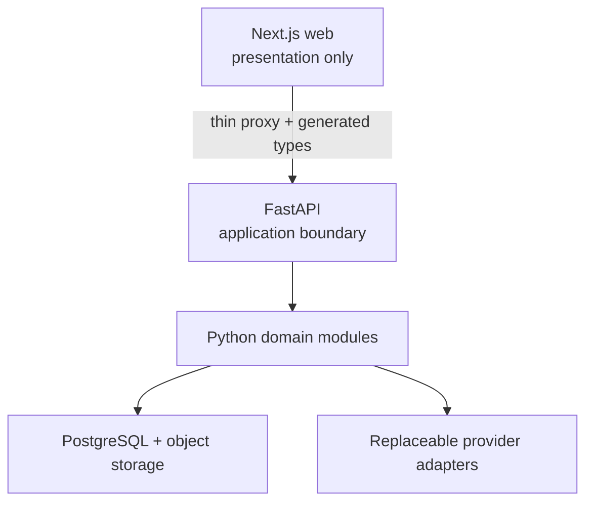

# Architecture overview

## Style

Galaxy Frog begins as a modular monolith in one repository. Deployment boundaries remain clear without paying the operational cost of microservices before load and failure measurements justify them.

## Repository modules

| Path | Responsibility | Must not contain |
|---|---|---|
| `apps/web` | UI, browser state, player controls, proxy handlers | AI, retrieval, parsing, database queries |
| `backend` | API, domain services, persistence, jobs, AI orchestration | Browser UI behavior |
| `infra` | Local infrastructure and later deployment definitions | Business rules |
| `scripts` | Deterministic repository automation | Long-running services |
| `docs` | Architecture, scope, ADRs, and runbooks | Secrets or generated artifacts |

## Dependency direction

- HTTP handlers depend on application services, never the reverse.
- Domain services depend on protocols, not provider SDK clients.
- Infrastructure adapters implement domain-facing protocols.
- Configuration selects adapters at startup and validates invalid combinations early.
- Frontend code depends on generated API contracts, not backend implementation details.

## Failure model

Every API failure will expose a stable error code, human-safe message, correlation ID, retry guidance, and optional structured details. Provider fallback decisions will be visible in telemetry and response metadata; a silent quality downgrade is not acceptable.

## Phase 0 deployment view

During Phase 0, the only runnable application processes will be the Next.js development server, FastAPI development server, and local PostgreSQL container. Background workers and AI providers arrive in later phases.
