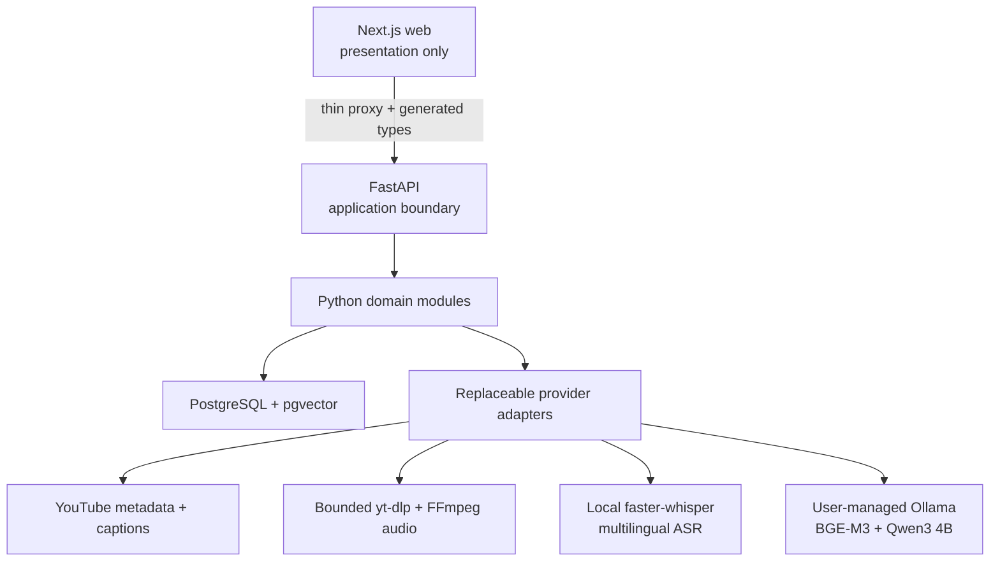

# Architecture overview

## Style

Galaxy Frog begins as a modular monolith in one repository. Deployment boundaries remain clear without paying the operational cost of microservices before load and failure measurements justify them.

## Repository modules

| Path | Responsibility | Must not contain |
|---|---|---|
| `apps/web` | UI, browser state, player controls, proxy handlers | AI, retrieval, parsing, database queries |
| `backend` | API, domain services, persistence, jobs, AI orchestration | Browser UI behavior |
| `infra` | Local infrastructure and later deployment definitions | Business rules |
| `scripts` | Deterministic repository automation | Long-running services |
| `docs` | Architecture, scope, ADRs, and runbooks | Secrets or generated artifacts |

## Dependency direction

- HTTP handlers depend on application services, never the reverse.
- Domain services depend on protocols, not provider SDK clients.
- Infrastructure adapters implement domain-facing protocols.
- Configuration selects adapters at startup and validates invalid combinations early.
- Frontend code depends on generated API contracts, not backend implementation details.

## API contract generation

FastAPI and Pydantic are the sole source of truth for HTTP schemas. The backend exports a sorted,
stable `backend/openapi.json` without loading local environment configuration or connecting to
PostgreSQL. `openapi-typescript` derives `apps/web/lib/api/generated/schema.d.ts` from that document.
Both files are committed, and `bun run contracts:check` fails when either artifact is stale.

## Browser-to-API boundary

The browser calls FastAPI only through the same-origin Next.js catch-all proxy. Its upstream origin
comes exclusively from the server-only `FASTAPI_BASE_URL`; caller-controlled hosts and path traversal
are rejected. The proxy streams request and response bodies, forwards only required headers,
preserves status and correlation metadata, uses a bounded timeout, and disables response caching.

Interactive browser code consumes generated OpenAPI types and performs small runtime shape checks at
the untrusted JSON boundary. Next.js owns presentation and transport adaptation only; it does not
reimplement Python application behavior.

## Failure model

Every API failure will expose a stable error code, human-safe message, correlation ID, retry guidance, and optional structured details. Provider fallback decisions will be visible in telemetry and response metadata; a silent quality downgrade is not acceptable.

FastAPI validates caller-provided correlation IDs, generates a UUID when one is absent or unsafe,
and returns the identifier in both `X-Correlation-ID` and structured error bodies. Validation,
framework HTTP, deliberate application, and unexpected failures all use the same envelope.

`/health/live` proves only that the API process can respond. `/health/ready` executes a PostgreSQL
query through an application-lifespan engine; database failure must never make liveness fail.

Provider availability is reported by the import/question operation that requires it rather than by
database readiness. A missing embedder or generator produces a stable, correlated API failure; it
does not silently change the model or answer quality.

## Planned Phase 8 provider policy boundary

Phase 8 adds product-facing provider configuration without moving provider policy into Next.js.
FastAPI will expose capability, health and versioned profile schemas through OpenAPI; the frontend
will consume the generated types, select a profile and render the resulting decision. Provider SDK
clients, credentials, availability probes, compatibility rules, quota state, fallback resolution
and cost calculations remain Python responsibilities.

The policy supports three explicit modes:

1. `automatic_local_only` is the default and considers only healthy, compatible local providers.
2. `automatic_cloud_permitted` may consider cloud providers only when the request includes current,
   explicit cloud-processing consent.
3. `manual` pins a provider/model and either disables fallback or supplies an ordered compatible
   fallback chain.

Cloud consent is independent from the selected mode, defaults to denied and cannot be inferred from
configured credentials. Losing a local provider, exhausting a quota or timing out never authorizes
uploading source media or evidence. Strict manual selection returns a recoverable error rather than
substituting a provider silently. Evaluation profiles pin the complete provider configuration and
disable automatic fallback.

Every provider run produces a durable decision record containing the requested mode/profile/model,
the resolved provider/model/revision/device, language and capability requirements, the selection
reason, ordered fallback attempts and reasons, input duration, processing time, estimated or actual
cost when reported, and pricing provenance (`source_url`, billing unit, currency and `verified_at`).
Pricing metadata is explanatory and can be marked stale; the provider's bill remains authoritative.

The UI presents model capabilities and the durable decision record. Provider cards show local or
cloud execution, language and code-switching coverage, privacy implications, expected quality,
measured speed, hardware needs, timestamp/confidence/diarization support and current availability.
Job details distinguish requested from actual execution and explain every fallback. None of these
presentation paths may discard or rewrite the original half-open timestamp intervals, source IDs,
cue links or evidence provenance.

Phase 2 prepares only the execution evidence needed by this later policy: its progress UI may show
the actual ASR provider, model, revision, device, timing and fallback reason as read-only data. The
interactive selector, editable profiles, cloud-consent controls and pricing presentation remain
Phase 8 work.

## Phase 1 transcript path

1. FastAPI canonicalizes an allowlisted YouTube URL and retrieves safe metadata and captions only.
2. Ordered transcript cues retain source identity and half-open millisecond intervals.
3. Deterministic retrieval units retain their contributing cue IDs.
4. BGE-M3 vectors are stored in a versioned 1,024-dimensional collection.
5. Video-scoped cosine retrieval returns units with complete cue provenance.
6. Qwen3 receives only retrieved transcript evidence; FastAPI validates every returned citation.
7. The browser renders evidence and asks the YouTube IFrame player to seek to validated timestamps.

## Phase 1 deployment view

The runnable local services are the Next.js development server, FastAPI development server,
PostgreSQL/pgvector container, and user-managed native Ollama service. Phase 1 has no worker, durable
job queue, media pipeline, ASR, OCR, visual retrieval, hybrid retrieval, reranker, or cloud provider.

## Phase 2 durable ingestion foundation

Phase 2 introduces a durable job boundary without moving business rules out of the Python modular
monolith:

1. A canonical source locator, normalized language preferences, and pipeline revision produce a
   deterministic SHA-256 input fingerprint.
2. PostgreSQL stores one idempotent `ingestion_jobs` projection per fingerprint and an append-only,
   per-job sequence of `job_events`.
3. Workers claim jobs through row locking with bounded leases, heartbeat while running, and may
   reclaim only expired work.
4. Every stage transition and reusable media/transcription output is committed as a checkpoint
   before the worker proceeds, so restart recovery does not depend on process memory.
5. Cancellation, retryability, safe error codes, attempt count, worker ownership, and lease expiry
   are explicit persisted state rather than implicit queue behavior.

The application layer owns the job lifecycle through provider-independent protocols. The initial
stage runner is transport-neutral: local PostgreSQL polling remains the development default, while
an optional QStash adapter may carry identifiers only and cannot become the source of truth. The
Phase 2 import API queues or reuses a durable job and returns immediately; the frontend declarations
for that asynchronous contract are generated from FastAPI OpenAPI.

The durable stage vocabulary is deliberately limited to Phase 2 ingestion work. It preserves video
identity and every caption or ASR cue's half-open millisecond interval and source provenance; it does
not introduce OCR, visual retrieval, hybrid retrieval, reranking, or LangGraph.

## Phase 2 bounded audio foundation

P2.5 introduced the local media boundary before P2.7 activated it, without moving media work into
the HTTP request:

1. An audio request cannot exist without a durable job/attempt, canonical source, expected duration,
   and an explicit `captions_unavailable` or `captions_unusable` fallback reason.
2. A local acquirer caps the complete operation, including concurrency wait, download, inspection,
   and normalization, with one deadline and one shared semaphore.
3. Every attempt owns only `tmp/media/{job_id}/attempt-{attempt}`. Cleanup validates this exact shape
   beneath the configured root before recursive deletion and never accepts a provider-returned path
   outside the attempt directory.
4. yt-dlp receives an argument array, single-video mode, duration filter, source-size ceiling,
   bounded retries/socket timeout, and an output template controlled by the worker.
5. ffprobe checks source duration and size before FFmpeg emits one mono 16 kHz `pcm_s16le` WAV;
   ffprobe then verifies codec, sample rate, channels, duration, and size again.
6. The resulting artifact preserves canonical source identity, fallback reason, the half-open
   `[0, duration_ms)` interval, acquisition time, and yt-dlp/FFmpeg revisions.
7. Failed or cancelled attempts clean their workspace immediately. After transcription,
   persistence, and indexing succeed, cleanup removes the artifact unless retention is configured.

## Phase 2 resumable caption-to-ASR path

P2.7 connects the provider-neutral media and transcription boundaries through durable evidence:

1. Caption retrieval selects and validates a track first. Only an unavailable or unusable transcript
   records an explicit fallback reason and advances to audio acquisition.
2. `media_assets` stores the attempt, exact source interval, local lifecycle state, and
   downloader/normalizer revisions. Filesystem paths remain internal and never enter job events or
   HTTP responses.
3. `transcription_runs` stores one result per job with its media identity, provider/model revisions,
   device/compute type, language evidence, processing time, and fallback reason.
4. `transcription_run_cues` stores the provider's ordered integer-millisecond intervals and optional
   confidence method before final video persistence.
5. Final `transcript_cues` identify their caption origin or link to exactly one transcription run;
   retrieval units retain the ordered cue IDs and reconstructed interval as before.
6. A failure before inference output resumes at transcription using retained audio. A failure after
   the transcription checkpoint reuses that run. Unique constraints prevent a second run or cue set.
7. Successful cleanup marks the media record deleted only after the transcript is persisted and
   indexed, preserving the database lineage after the local file is gone.

FastAPI owns the safe transcript execution schema and generated browser declarations. Next.js may
display the actual provider, model, revision, device, timing, confidence, and fallback reason, but it
receives no local media path and cannot select or execute a provider during Phase 2.

## Phase 2 progress and recovery presentation

P2.8 keeps the browser as a generated-contract consumer. The import response supplies the first
durable job projection; the client polls job detail, refreshes ordered events, and derives labels and
progress only from FastAPI-owned enum values. Cancellation and retry post to FastAPI through the same
thin proxy. The UI never mutates a stage locally, and it offers retry only when the returned job marks
the last failure retryable.

After success, the transcript response remains the evidence source. Caption-backed results state
that ASR was skipped. ASR-backed results present the actual run/provider/model revisions,
device/compute type, language confidence, processing time, source interval, caption-fallback reason,
and cue confidence. These are read-only facts about what ran, not a provider-configuration surface.
The existing player, grounded-question, retrieval evidence, and citation-seeking paths remain
unchanged.
