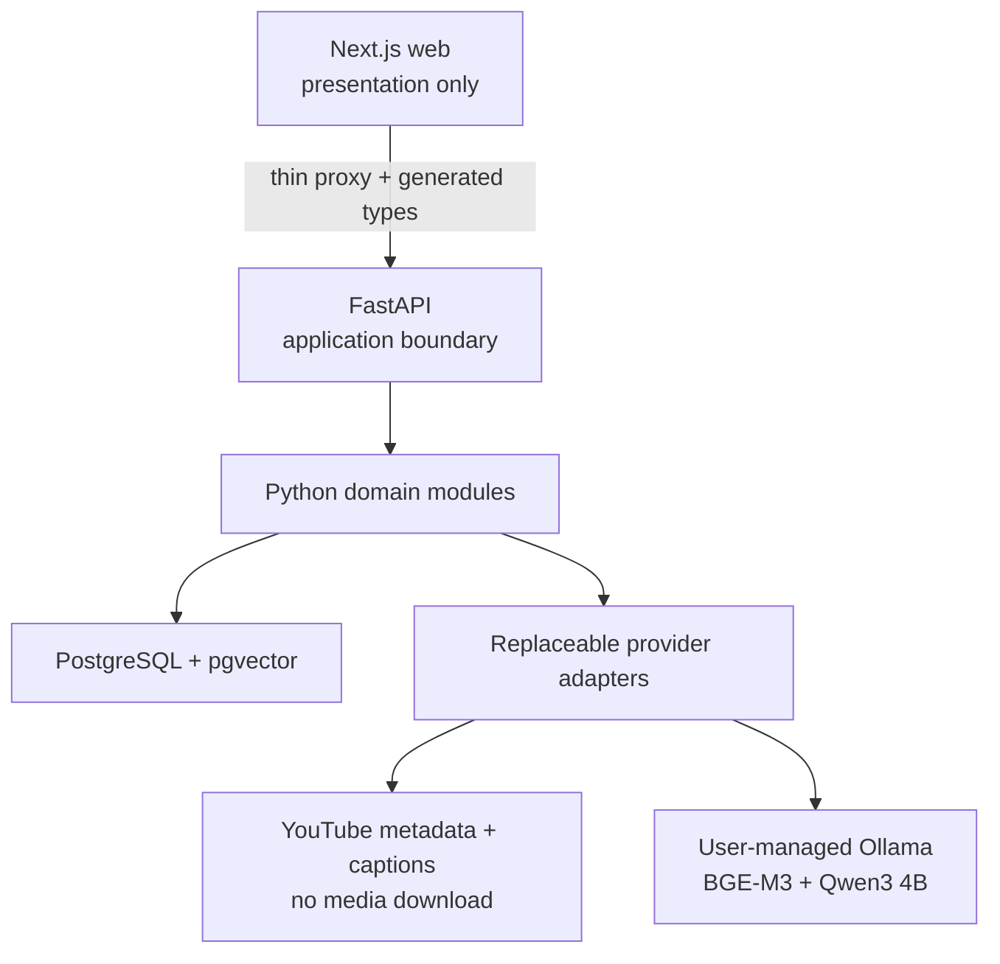

# Architecture overview

## Style

Galaxy Frog begins as a modular monolith in one repository. Deployment boundaries remain clear without paying the operational cost of microservices before load and failure measurements justify them.

## Repository modules

| Path | Responsibility | Must not contain |
|---|---|---|
| `apps/web` | UI, browser state, player controls, proxy handlers | AI, retrieval, parsing, database queries |
| `backend` | API, domain services, persistence, jobs, AI orchestration | Browser UI behavior |
| `infra` | Local infrastructure and later deployment definitions | Business rules |
| `scripts` | Deterministic repository automation | Long-running services |
| `docs` | Architecture, scope, ADRs, and runbooks | Secrets or generated artifacts |

## Dependency direction

- HTTP handlers depend on application services, never the reverse.
- Domain services depend on protocols, not provider SDK clients.
- Infrastructure adapters implement domain-facing protocols.
- Configuration selects adapters at startup and validates invalid combinations early.
- Frontend code depends on generated API contracts, not backend implementation details.

## API contract generation

FastAPI and Pydantic are the sole source of truth for HTTP schemas. The backend exports a sorted,
stable `backend/openapi.json` without loading local environment configuration or connecting to
PostgreSQL. `openapi-typescript` derives `apps/web/lib/api/generated/schema.d.ts` from that document.
Both files are committed, and `bun run contracts:check` fails when either artifact is stale.

## Browser-to-API boundary

The browser calls FastAPI only through the same-origin Next.js catch-all proxy. Its upstream origin
comes exclusively from the server-only `FASTAPI_BASE_URL`; caller-controlled hosts and path traversal
are rejected. The proxy streams request and response bodies, forwards only required headers,
preserves status and correlation metadata, uses a bounded timeout, and disables response caching.

Interactive browser code consumes generated OpenAPI types and performs small runtime shape checks at
the untrusted JSON boundary. Next.js owns presentation and transport adaptation only; it does not
reimplement Python application behavior.

## Failure model

Every API failure will expose a stable error code, human-safe message, correlation ID, retry guidance, and optional structured details. Provider fallback decisions will be visible in telemetry and response metadata; a silent quality downgrade is not acceptable.

FastAPI validates caller-provided correlation IDs, generates a UUID when one is absent or unsafe,
and returns the identifier in both `X-Correlation-ID` and structured error bodies. Validation,
framework HTTP, deliberate application, and unexpected failures all use the same envelope.

`/health/live` proves only that the API process can respond. `/health/ready` executes a PostgreSQL
query through an application-lifespan engine; database failure must never make liveness fail.

Provider availability is reported by the import/question operation that requires it rather than by
database readiness. A missing embedder or generator produces a stable, correlated API failure; it
does not silently change the model or answer quality.

## Phase 1 transcript path

1. FastAPI canonicalizes an allowlisted YouTube URL and retrieves safe metadata and captions only.
2. Ordered transcript cues retain source identity and half-open millisecond intervals.
3. Deterministic retrieval units retain their contributing cue IDs.
4. BGE-M3 vectors are stored in a versioned 1,024-dimensional collection.
5. Video-scoped cosine retrieval returns units with complete cue provenance.
6. Qwen3 receives only retrieved transcript evidence; FastAPI validates every returned citation.
7. The browser renders evidence and asks the YouTube IFrame player to seek to validated timestamps.

## Phase 1 deployment view

The runnable local services are the Next.js development server, FastAPI development server,
PostgreSQL/pgvector container, and user-managed native Ollama service. Phase 1 has no worker, durable
job queue, media pipeline, ASR, OCR, visual retrieval, hybrid retrieval, reranker, or cloud provider.

## Phase 2 durable ingestion foundation

Phase 2 introduces a durable job boundary without moving business rules out of the Python modular
monolith:

1. A canonical source locator, normalized language preferences, and pipeline revision produce a
   deterministic SHA-256 input fingerprint.
2. PostgreSQL stores one idempotent `ingestion_jobs` projection per fingerprint and an append-only,
   per-job sequence of `job_events`.
3. Workers claim jobs through row locking with bounded leases, heartbeat while running, and may
   reclaim only expired work.
4. Every stage transition is committed as a checkpoint before the worker proceeds, so restart
   recovery does not depend on process memory.
5. Cancellation, retryability, safe error codes, attempt count, worker ownership, and lease expiry
   are explicit persisted state rather than implicit queue behavior.

The application layer owns the job lifecycle through provider-independent protocols. The initial
stage runner is transport-neutral: local PostgreSQL polling remains the development default, while
an optional QStash adapter may carry identifiers only and cannot become the source of truth. The
Phase 2 import API queues or reuses a durable job and returns immediately; the frontend declarations
for that asynchronous contract are generated from FastAPI OpenAPI.

The durable stage vocabulary is deliberately limited to Phase 2 ingestion work. It preserves video
identity and will preserve every transcript cue's half-open millisecond interval and source
provenance when caption-to-ASR fallback is added; it does not introduce OCR, visual retrieval,
hybrid retrieval, reranking, or LangGraph.
